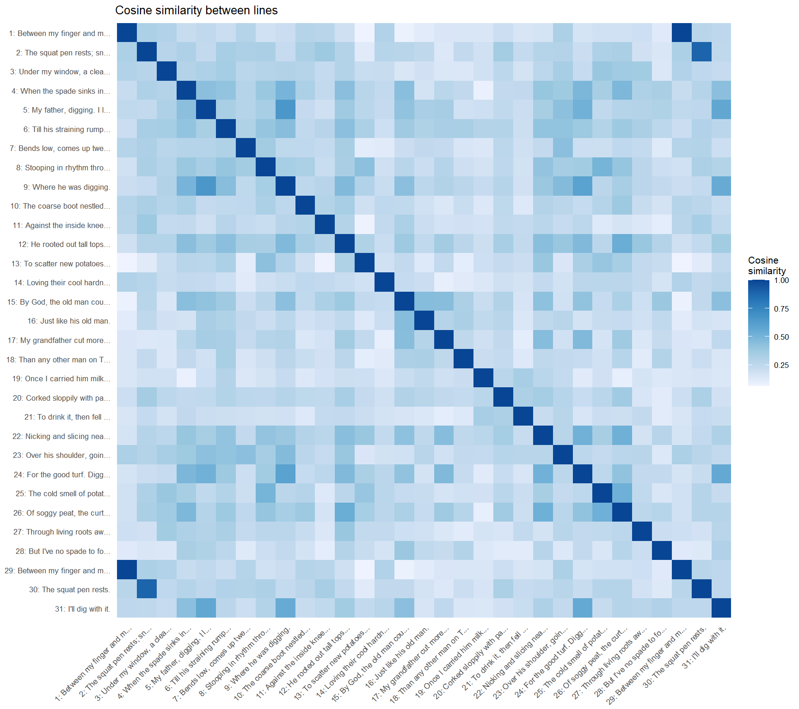
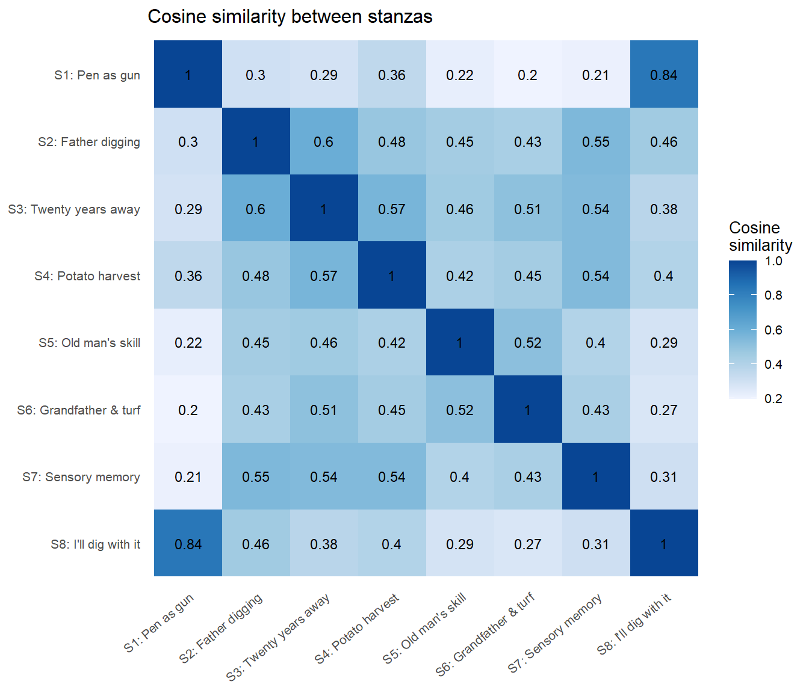
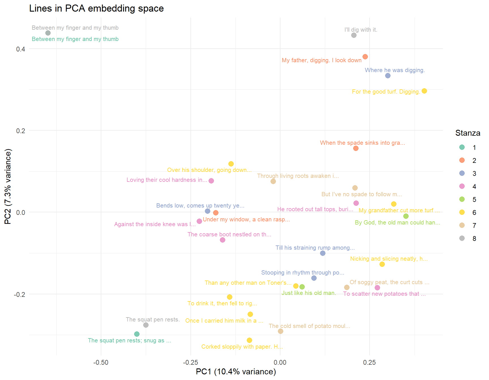
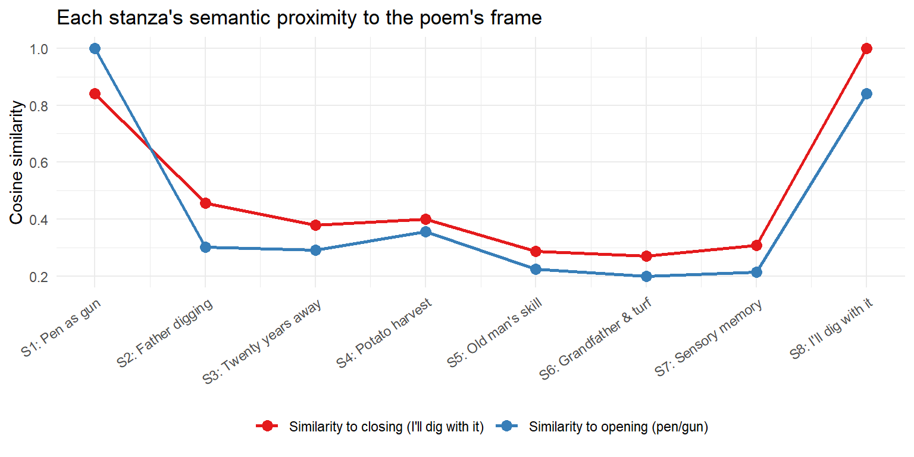
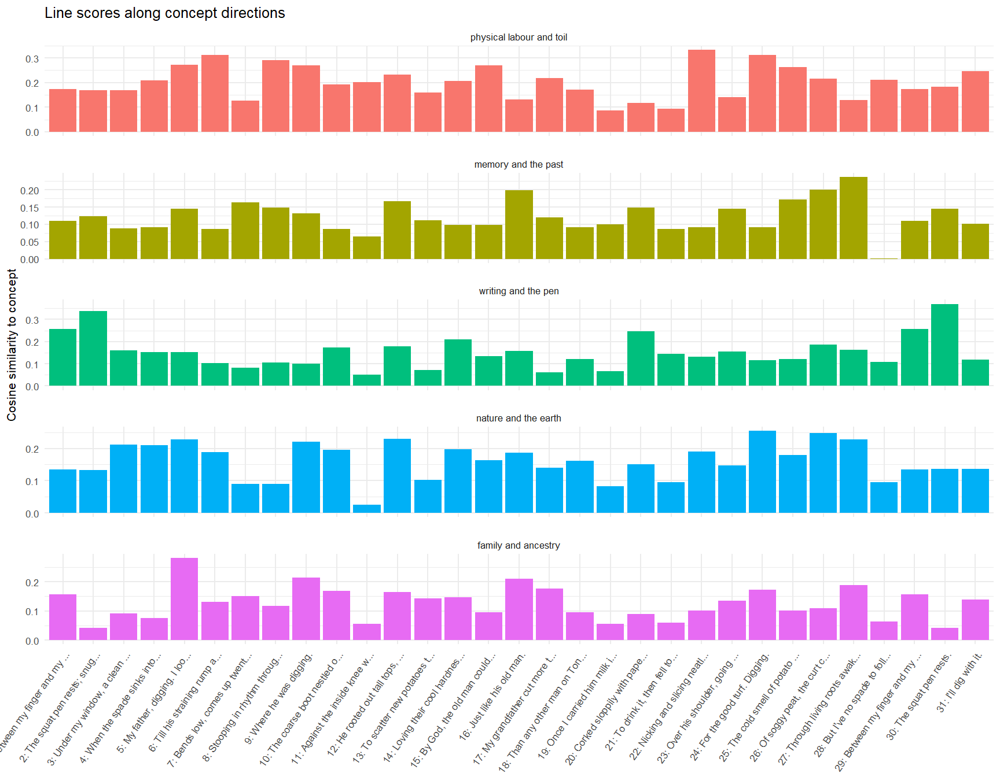

> **Requires:** An OpenAI API key stored as `OPENAI_API_KEY` in your `.Renviron`
> (run `usethis::edit_r_environ()` to open it). You'll also need the `openai`
> package: `install.packages("openai")`.

## The Poem

::: {style="font-family: Georgia, serif; font-size: 1.05em; line-height: 1.8; max-width: 480px; margin: 0 auto; padding: 1em 0;"}
Between my finger and my thumb\
The squat pen rests; snug as a gun.

Under my window, a clean rasping sound\
When the spade sinks into gravelly ground:\
My father, digging. I look down

Till his straining rump among the flowerbeds\
Bends low, comes up twenty years away\
Stooping in rhythm through potato drills\
Where he was digging.

The coarse boot nestled on the lug, the shaft\
Against the inside knee was levered firmly.\
He rooted out tall tops, buried the bright edge deep\
To scatter new potatoes that we picked,\
Loving their cool hardness in our hands.

By God, the old man could handle a spade.\
Just like his old man.

My grandfather cut more turf in a day\
Than any other man on Toner's bog.\
Once I carried him milk in a bottle\
Corked sloppily with paper. He straightened up\
To drink it, then fell to right away\
Nicking and slicing neatly, heaving sods\
Over his shoulder, going down and down\
For the good turf. Digging.

The cold smell of potato mould, the squelch and slap\
Of soggy peat, the curt cuts of an edge\
Through living roots awaken in my head.\
But I've no spade to follow men like them.

Between my finger and my thumb\
The squat pen rests.\
I'll dig with it.
:::

---

## Parse the Poem

We'll work at two levels of granularity: individual **lines** and **stanzas**.
Line-level embeddings let us see which individual images or phrases cluster
together; stanza-level embeddings reveal broader thematic arcs.


::: {.cell}

```{.r .cell-code}
poem_lines <- tibble(
  line_num = 1:31,
  stanza   = c(1, 1,
               2, 2, 2,
               3, 3, 3, 3,
               4, 4, 4, 4, 4,
               5, 5,
               6, 6, 6, 6, 6, 6, 6, 6,
               7, 7, 7, 7,
               8, 8, 8),
  text = c(
    "Between my finger and my thumb",
    "The squat pen rests; snug as a gun.",
    "Under my window, a clean rasping sound",
    "When the spade sinks into gravelly ground:",
    "My father, digging. I look down",
    "Till his straining rump among the flowerbeds",
    "Bends low, comes up twenty years away",
    "Stooping in rhythm through potato drills",
    "Where he was digging.",
    "The coarse boot nestled on the lug, the shaft",
    "Against the inside knee was levered firmly.",
    "He rooted out tall tops, buried the bright edge deep",
    "To scatter new potatoes that we picked,",
    "Loving their cool hardness in our hands.",
    "By God, the old man could handle a spade.",
    "Just like his old man.",
    "My grandfather cut more turf in a day",
    "Than any other man on Toner's bog.",
    "Once I carried him milk in a bottle",
    "Corked sloppily with paper. He straightened up",
    "To drink it, then fell to right away",
    "Nicking and slicing neatly, heaving sods",
    "Over his shoulder, going down and down",
    "For the good turf. Digging.",
    "The cold smell of potato mould, the squelch and slap",
    "Of soggy peat, the curt cuts of an edge",
    "Through living roots awaken in my head.",
    "But I've no spade to follow men like them.",
    "Between my finger and my thumb",
    "The squat pen rests.",
    "I'll dig with it."
  )
)

poem_stanzas <- tibble(
  stanza_num = 1:8,
  label = c(
    "S1: Pen as gun",
    "S2: Father digging",
    "S3: Twenty years away",
    "S4: Potato harvest",
    "S5: Old man's skill",
    "S6: Grandfather & turf",
    "S7: Sensory memory",
    "S8: I'll dig with it"
  ),
  text = c(
    "Between my finger and my thumb. The squat pen rests; snug as a gun.",
    "Under my window, a clean rasping sound. When the spade sinks into gravelly ground: My father, digging. I look down.",
    "Till his straining rump among the flowerbeds. Bends low, comes up twenty years away. Stooping in rhythm through potato drills. Where he was digging.",
    "The coarse boot nestled on the lug, the shaft. Against the inside knee was levered firmly. He rooted out tall tops, buried the bright edge deep. To scatter new potatoes that we picked, Loving their cool hardness in our hands.",
    "By God, the old man could handle a spade. Just like his old man.",
    "My grandfather cut more turf in a day than any other man on Toner's bog. Once I carried him milk in a bottle corked sloppily with paper. He straightened up to drink it, then fell to right away nicking and slicing neatly, heaving sods over his shoulder, going down and down for the good turf. Digging.",
    "The cold smell of potato mould, the squelch and slap of soggy peat, the curt cuts of an edge through living roots awaken in my head. But I've no spade to follow men like them.",
    "Between my finger and my thumb. The squat pen rests. I'll dig with it."
  )
)
```
:::


---

## Generate Embeddings

We use OpenAI's `text-embedding-3-small` model — a compact but capable
embedding model well-suited for short texts.


::: {.cell}

```{.r .cell-code}
embed_texts <- function(texts, model = "text-embedding-3-small") {
  result <- openai::create_embedding(model = model, input = texts)
  do.call(rbind, result$data$embedding)
}

line_emb    <- embed_texts(poem_lines$text)
stanza_emb  <- embed_texts(poem_stanzas$text)
```
:::


---

## Cosine Similarity

Cosine similarity measures the angle between two embedding vectors: 1 means
identical direction (very similar meaning), 0 means orthogonal (unrelated).


::: {.cell}

```{.r .cell-code}
cosine_matrix <- function(mat) {
  norms    <- sqrt(rowSums(mat^2))
  mat_norm <- mat / norms
  sim      <- mat_norm %*% t(mat_norm)
  sim      <- round(sim, 3)
  sim
}

line_sim   <- cosine_matrix(line_emb)
stanza_sim <- cosine_matrix(stanza_emb)
```
:::


### Line-level heatmap

Each cell shows how semantically similar two lines are. The diagonal is always 1
(a line compared to itself).


::: {.cell}

```{.r .cell-code}
short_label <- paste0(poem_lines$line_num, ": ",
                      str_trunc(poem_lines$text, 26))

line_sim_long <- expand.grid(
    line_a = seq_len(nrow(line_sim)),
    line_b = seq_len(nrow(line_sim))
  ) |>
  mutate(
    similarity = line_sim[cbind(line_a, line_b)],
    label_a    = factor(short_label[line_a], levels = short_label),
    label_b    = factor(short_label[line_b], levels = rev(short_label))
  )

ggplot(line_sim_long, aes(x = label_a, y = label_b, fill = similarity)) +
  geom_tile() +
  scale_fill_distiller(palette = "Blues", direction = 1,
                       name = "Cosine\nsimilarity") +
  theme_minimal(base_size = 8) +
  theme(
    axis.text.x = element_text(angle = 45, hjust = 1),
    axis.title   = element_blank(),
    panel.grid   = element_blank()
  ) +
  labs(title = "Cosine similarity between lines")
```

::: {.cell-output-display}
{width=864}
:::
:::


### Stanza-level heatmap


::: {.cell}

```{.r .cell-code}
stanza_sim_long <- expand.grid(
    stanza_a = seq_len(nrow(stanza_sim)),
    stanza_b = seq_len(nrow(stanza_sim))
  ) |>
  mutate(
    similarity = stanza_sim[cbind(stanza_a, stanza_b)],
    label_a    = factor(poem_stanzas$label[stanza_a],
                        levels = poem_stanzas$label),
    label_b    = factor(poem_stanzas$label[stanza_b],
                        levels = rev(poem_stanzas$label))
  )

ggplot(stanza_sim_long, aes(x = label_a, y = label_b, fill = similarity)) +
  geom_tile() +
  geom_text(aes(label = round(similarity, 2)), size = 3.2) +
  scale_fill_distiller(palette = "Blues", direction = 1,
                       name = "Cosine\nsimilarity") +
  theme_minimal(base_size = 10) +
  theme(
    axis.text.x = element_text(angle = 40, hjust = 1),
    axis.title   = element_blank(),
    panel.grid   = element_blank()
  ) +
  labs(title = "Cosine similarity between stanzas")
```

::: {.cell-output-display}
{width=672}
:::
:::


---

## PCA: Lines in Embedding Space

We reduce the high-dimensional embedding vectors to 2D using PCA, then plot
each line. Lines that cluster together share semantic neighbourhood in the
model's representation.


::: {.cell}

```{.r .cell-code}
pca_fit <- prcomp(line_emb, scale. = FALSE)

pca_df <- as_tibble(pca_fit$x[, 1:2]) |>
  bind_cols(poem_lines) |>
  mutate(short_text = str_trunc(text, 32))

# Variance explained
var_exp <- summary(pca_fit)$importance["Proportion of Variance", 1:2] * 100

ggplot(pca_df, aes(x = PC1, y = PC2, color = factor(stanza), label = short_text)) +
  geom_point(size = 3, alpha = 0.85) +
  ggrepel::geom_text_repel(size = 2.8, max.overlaps = 20,
                            show.legend = FALSE) +
  scale_color_brewer(palette = "Set2", name = "Stanza") +
  labs(
    title = "Lines in PCA embedding space",
    x = sprintf("PC1 (%.1f%% variance)", var_exp[1]),
    y = sprintf("PC2 (%.1f%% variance)", var_exp[2])
  ) +
  theme_minimal(base_size = 11)
```

::: {.cell-output-display}
{width=864}
:::
:::


---

## Most & Least Similar Line Pairs

The top and bottom cosine similarities reveal which lines the model considers
semantically closest and most distant — often a more concrete way to interpret
the embedding structure than a heatmap.


::: {.cell}

```{.r .cell-code}
line_sim_pairs <- expand.grid(
    line_a = seq_len(nrow(line_sim)),
    line_b = seq_len(nrow(line_sim))
  ) |>
  filter(line_a < line_b) |>
  mutate(
    similarity = line_sim[cbind(line_a, line_b)],
    text_a     = poem_lines$text[line_a],
    text_b     = poem_lines$text[line_b]
  )

cat("--- Most similar pairs ---\n")
```

::: {.cell-output .cell-output-stdout}

```
--- Most similar pairs ---
```


:::

```{.r .cell-code}
line_sim_pairs |>
  slice_max(similarity, n = 8) |>
  select(similarity, text_a, text_b) |>
  print()
```

::: {.cell-output .cell-output-stdout}

```
  similarity                                               text_a
1      1.000                       Between my finger and my thumb
2      0.890                  The squat pen rests; snug as a gun.
3      0.658                      My father, digging. I look down
4      0.600                                Where he was digging.
5      0.571                      My father, digging. I look down
6      0.561                          For the good turf. Digging.
7      0.549                                Where he was digging.
8      0.537 He rooted out tall tops, buried the bright edge deep
                                   text_b
1          Between my finger and my thumb
2                    The squat pen rests.
3                   Where he was digging.
4             For the good turf. Digging.
5                       I'll dig with it.
6                       I'll dig with it.
7                       I'll dig with it.
8 Of soggy peat, the curt cuts of an edge
```


:::

```{.r .cell-code}
cat("\n--- Least similar pairs ---\n")
```

::: {.cell-output .cell-output-stdout}

```

--- Least similar pairs ---
```


:::

```{.r .cell-code}
line_sim_pairs |>
  slice_min(similarity, n = 8) |>
  select(similarity, text_a, text_b) |>
  print()
```

::: {.cell-output .cell-output-stdout}

```
  similarity                                      text_a
1      0.063              Between my finger and my thumb
2      0.063     To scatter new potatoes that we picked,
3      0.068 Against the inside knee was levered firmly.
4      0.079              Between my finger and my thumb
5      0.079   By God, the old man could handle a spade.
6      0.084  When the spade sinks into gravelly ground:
7      0.093         Once I carried him milk in a bottle
8      0.095    Loving their cool hardness in our hands.
                                     text_b
1   To scatter new potatoes that we picked,
2            Between my finger and my thumb
3   To scatter new potatoes that we picked,
4 By God, the old man could handle a spade.
5            Between my finger and my thumb
6       Once I carried him milk in a bottle
7   Of soggy peat, the curt cuts of an edge
8     My grandfather cut more turf in a day
```


:::
:::


---

## Stanza Arc: Similarity to the Opening and Closing Stanzas

The poem opens and closes with nearly the same lines ("Between my finger and my
thumb..."), making this a useful lens: how does each stanza relate to the
frame the poem builds around itself?


::: {.cell}

```{.r .cell-code}
arc_df <- poem_stanzas |>
  mutate(
    sim_to_opening = stanza_sim[, 1],
    sim_to_closing = stanza_sim[, 8]
  ) |>
  pivot_longer(
    cols = starts_with("sim_"),
    names_to  = "reference",
    values_to = "similarity"
  ) |>
  mutate(
    reference = case_match(reference,
      "sim_to_opening" ~ "Similarity to opening (pen/gun)",
      "sim_to_closing" ~ "Similarity to closing (I'll dig with it)"
    )
  )

ggplot(arc_df, aes(x = stanza_num, y = similarity,
                   color = reference, group = reference)) +
  geom_line(linewidth = 1) +
  geom_point(size = 3) +
  scale_x_continuous(breaks = 1:8, labels = poem_stanzas$label,
                     guide = guide_axis(angle = 35)) +
  scale_color_brewer(palette = "Set1", name = NULL) +
  labs(
    title    = "Each stanza's semantic proximity to the poem's frame",
    x        = NULL,
    y        = "Cosine similarity"
  ) +
  theme_minimal(base_size = 11) +
  theme(legend.position = "bottom")
```

::: {.cell-output-display}
{width=768}
:::
:::


---

## Concept Probing

Individual embedding dimensions are not human-interpretable — meaning is
distributed across all 1,536 of them simultaneously. But we can define our own
semantic directions by embedding a short phrase that captures a concept, then
projecting each line onto that direction via cosine similarity. Lines with a
higher score are closer to that concept in the model's representation.

**To adapt this for a different poem**, edit `concept_probes` below. Each
named entry becomes a panel in the chart. Aim for specific, evocative phrases
rather than single words — the model responds better to context.


::: {.cell}

```{.r .cell-code}
# ── Edit this list to change or add concepts ──────────────────────────────────
concept_probes <- c(
  "physical labour and toil"        = "physical labour and toil",
  "memory and the past"             = "memory and the past",
  "writing and the pen"             = "writing and the pen",
  "nature and the earth"            = "nature and the earth",
  "family and ancestry"             = "family and ancestry"
)
# ──────────────────────────────────────────────────────────────────────────────
```
:::


::: {.cell}

```{.r .cell-code}
# Embed each concept phrase
concept_result <- openai::create_embedding(
  model = "text-embedding-3-small",
  input = unname(concept_probes)
)
concept_mat <- do.call(rbind, concept_result$data$embedding)

# L2-normalise both sets of vectors, then project via dot product
l2_norm <- function(mat) mat / sqrt(rowSums(mat^2))

scores <- l2_norm(line_emb) %*% t(l2_norm(concept_mat))
colnames(scores) <- names(concept_probes)

# Long format for plotting
scores_long <- as_tibble(scores) |>
  bind_cols(poem_lines |> select(line_num, text)) |>
  pivot_longer(
    cols      = all_of(names(concept_probes)),
    names_to  = "concept",
    values_to = "score"
  ) |>
  mutate(
    concept    = factor(concept, levels = names(concept_probes)),
    short_text = fct_inorder(paste0(line_num, ": ", str_trunc(text, 28)))
  )

ggplot(scores_long, aes(x = short_text, y = score, fill = concept)) +
  geom_col() +
  facet_wrap(~ concept, ncol = 1, scales = "free_y") +
  theme_minimal(base_size = 8) +
  theme(
    axis.text.x     = element_text(angle = 55, hjust = 1),
    legend.position = "none",
    panel.spacing   = unit(0.8, "lines")
  ) +
  labs(
    title = "Line scores along concept directions",
    x     = NULL,
    y     = "Cosine similarity to concept"
  )
```

::: {.cell-output-display}
{width=864}
:::
:::

